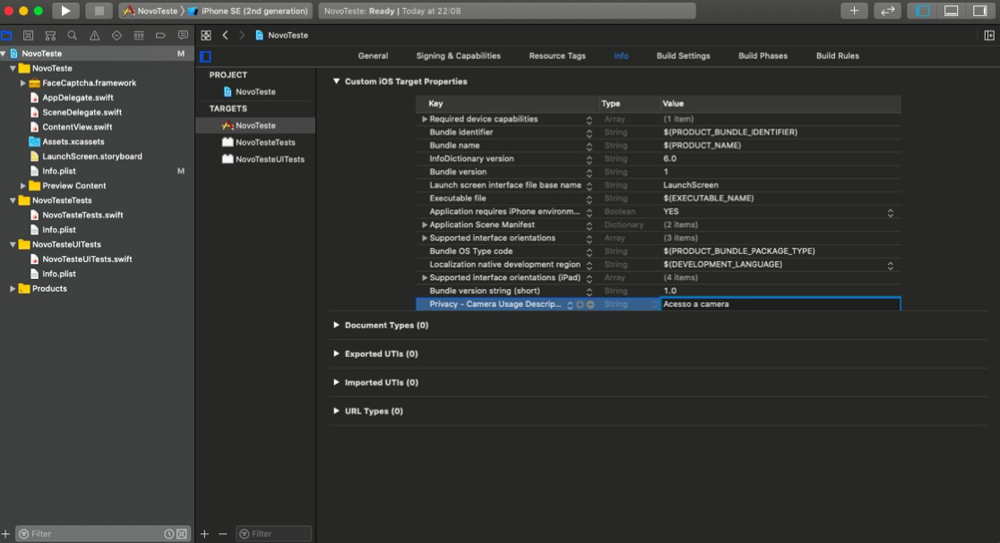

# Liveness

Biblioteca Liveness para iOS.

## Instalação

O SDK está disponível via [CocoaPods](https://cocoapods.org/) (forma recomendada), mas também pode ser instalado manualmente.

### CocoaPods

1. No início do `Podfile`, inclua a linha:
```rb
source 'https://github.com/oititec/liveness-ios-specs.git'
```
2. Após isso, adicione a dependência:
```rb
pod 'FaceCaptcha', '~> 2.0.0'
```
3. Rode `pod install`.

### Manual

Para adicionar o SDK manualmente no seu projeto, siga estas [instruções](Documentation/ManualInstallation.md).

## Uso

### Permissões de acesso

 No `Info.plist` do projeto, adicione as descrições de uso de câmera (`Privacy - Camera Usage Description`) e microfone (`Privacy - Microphone Usage Description`):



### Iniciando o FaceCaptcha

1. Importe o FaceCaptcha no controller onde irá usá-lo:
```swift
import FaceCaptcha
```

2. Crie uma referência para um objeto do tipo `FCCameraCapture`. Este objeto deve ser mantido durante todo o processo de prova de vida:
```swift
private var faceCaptcha: FCCameraCapture?
```

3. Instancie o `FCCameraCapture`, com os seguintes parâmetros:
- *appkey*: App Key recebida previamente. Deve ser diferente para cada vez que for apresentar o FaceCaptcha.
- *baseURL*: URL apontando para o ambiente desejado.
- *viewController*: `UIVIewController` que será utilizado para apresentar o FaceCaptcha.
- *delegate*: objeto que deve implementar o protocolo `FCCameraCaptureDelegate`, para receber o retorno da prova de vida.
- *showSetupErrors*: Booleano que indica se o SDK deve apresentar dialogs de erro durante a fase de inicialização, por exemplo: erro de permissão de câmera e erro de conexão. Independente deste valor, a callback de erro sempre será chamada.
```swift
let baseURL = ""
let appKey = ""
faceCaptcha = FCCameraCapture(appkey: appKey,
                              baseURL: baseURL,
                              viewController: self,
                              delegate: self,
                              showSetupErrors: false)
```

4. Chame o método show() para apresentar:
```swift
faceCaptcha?.show()
```

### Tratando o retorno

1. Implemente o protocolo `FCCameraCaptureDelegate` para ser notificado sobre a conclusão da prova de vida:
```swift
public protocol FCCameraCaptureDelegate: class {
    func handleCaptureValidation(validateModel: FCValidCaptchaModel)
    func handleCaptureVideoError(error: FaceCaptchaError, imageBase64: String?)
    func handleCaptureCanceled()
}
```

Este protocolo contém dois métodos:

- *handleCaptureValidation*: recebe um objeto do tipo `FCValidCaptchaModel`, no qual é possível verificar se a prova de vida foi válida, e, caso não tenha sido, o motivo pelo qual falhou.
- *handleCaptureVideoError*: recebe um enum do tipo `FaceCaptchaError`, que indica o erro ocorrido, e também uma imagem opcional (em formato Base64), que pode ser retornada em alguns cenários de erro.
- *handleCaptureCanceled*: método chamado se o usuário clicar no botão fechar/cancelar.

**Importante:** em todos os métodos, deve-se atribuir `nil` ao objeto `faceCaptcha`, para que o FaceCaptcha seja finalizado e desalocado, evitando memory leaks.

`FaceCaptchaError` pode assumir os seguintes valores:
```swift
public enum FaceCaptchaError {
    /// App Key inválido.
    case invalidAppKey
    /// Certiface offline.
    case certifaceOff
    /// Não foi concedida permissão de acesso à câmera do aparelho.
    case noCameraPermission
    /// Sem conexão à Internet.
    case noInternetConnection
    /// Chamada telefônica em andamento. Não é possível iniciar o desafio durante uma chamada telefônica.
    case phoneCallInProgress
    /// Erro na requisição de validação dos desafios.
    case validationError
    /// App foi minimizado durante o uso do FaceCaptcha, isso faz com que o desafio seja encerrado.
    case challengeInterrupted
}
```

### Customização

Além de poder usar o SDK em sua forma padrão de exibição, são fornecidas duas formas de customização: 

1. Imagem de fundo customizada:
Para exibir uma imagem de fundo (overlay da câmera) customizada, basta passar a imagem desejada para o construtor do `FCCameraCapture`, através do parâmetro `cameraOverlay`. Exemplo:
```swift
faceCaptcha = FCCameraCapture(appkey: appKey,
                              baseURL: baseURL,
                              viewController: self,
                              delegate: self,
                              showSetupErrors: false,
                              cameraOverlay: UIImage(named: "custom_overlay"))
```

2. Visual completamente customizado:
É possível configurar completamente o visual exibido pelo FaceCaptcha. Para isso, é necessário criar uma UIView que implemente o protocolo `FCView`, e passá-la para o construtor do `FCCameraCapture` através do parâmetro `customView`. Exemplo:
```swift
// MyCustomView must implement FCView
let customView: FCView = MyCustomView(frame: view.bounds)
faceCaptcha = FCCameraCapture(appkey: appKey,
                              baseURL: baseURL,
                              viewController: self,
                              delegate: self,
                              showSetupErrors: false,
                              customView: customView)
```
Detalhes de como implementar a view customizada são encontrados [neste link](Documentation/CustomView.md).

## Sample

Um exemplo de implementação pode ser encontrado no projeto [SampleFaceCaptcha](https://github.com/oititec/liveness-ios-sdk/tree/main/SampleFaceCaptcha "SampleFaceCaptcha"), neste mesmo repositório.

## Documentação Auxiliar

- [Troubleshooting](Documentation/Troubleshooting.md)

## Release notes

- As novidades das versões podem ser acessadas [neste link](Documentation/ReleaseNotes.md).

## Guias de migração

- [2.0.0](Documentation/Migration-Guide-2.0.0.md) - BREAKING CHANGE
- [1.2.0](Documentation/Migration-Guide-1.2.0.md) - BREAKING CHANGE
